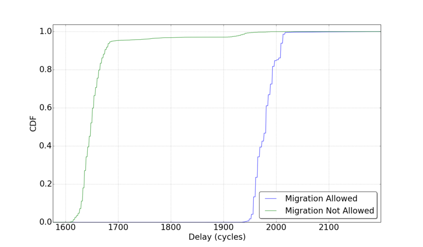

In this post I share benchmarking results detailing the costs of a virtualization exit on my Intel i7-3960X processor. I will also describe how I modified the KVM and guest kernel to gather these results. First, a little background.

An alternative to virtualization using software translation (like the Tiny Code Generator mode of QEMU) is HW virtualization by the processor. Intel "Virtual Machine Extensions" (VMX) adds new modes of operation to enable execution of native instructions on the "bare metal" i.e. the CPU itself. A few new instructions, and a structure called the "Virtual Machine Control Structure" allows the "Virtual Machine Manager" (VMM) to manage the Virtual Machine (VM).

The processor will execute as many instructions as it can without involving the VMM (commonly referred to as the Hyper-Visor). When the VM encounters certain events or attempts to execute some special instructions a #VMExit occurs and the processor switches from "non-root" mode of operation (mode its in while executing VM instructions) to the "root" mode of operation (mode when running the VMM instructions). This is because these events need to be "virtualized" (read emulated/supervised) by the Hyper-Visor. Examples of this could include, the VM attempting to access Memory Mapped IO (happens when interacting with physical devices), the VM attempting to send an Inter-Process Interrupt (or one arriving for that matter), or when executing certain instructions like CPUID or MONITOR/MWAIT. These #VMExit events represent the primary source of overhead when running a virtual machine. This is why Intel adds VT extensions (EPT, VTd, VTX*) that focus on either reducing the frequency of these events or reducing their cost.

To measure the overhead on my processor I made slight modifications to the Linux kernel and the KVM Hypervisor. For the guest Linux kernel, I added two short system calls. One forces a #VMExit by executing a VMCall instruction (this is what is typically used by the guest OS to make Hypercalls to the Hypervisor). The other is a nop syscall and is just there to account for the overhead of the system call within the guest. On the Hypervisor side, at the top of the #VMExit handler I added code to return to the guest any time it detects one of these fake VMCalls (signaled by state of guest registers). Finally, one simple C program to run the experiments by invoking the syscalls and measuring the cycles elapsed. The results are below. You can find all the code [here](https://github.com/yshalabi/VMExit-Delay).

As you can see, this is quite the expensive event. Definitely one of the more expensive events that can occur in your processors pipeline. This is why Para-Virtualized (PV) drivers can dramatically improve performance of a VM. With PV writing to a network card will generate a single #VMExit for the Hyper-Call as opposed one for each memory access to the MMIO region corresponding to the virtual device. Note that the green line represents the overhead when the VM was "pinned" to physical cores. As the graph indicates, in those cases the majority (~95%) of overheads lie between 1600-1700. The rest creep on the higher cost when migration is allowed.
